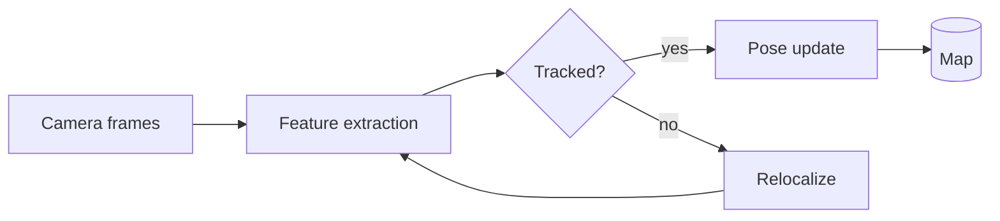
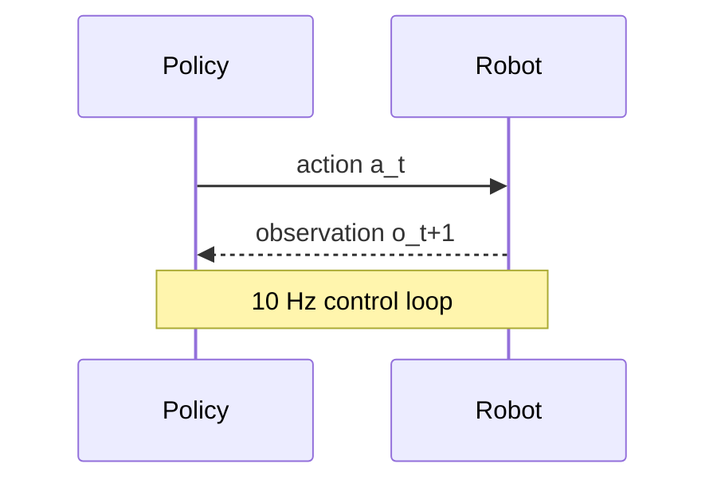

Flowchart:


```mermaid
graph LR
    A[Camera frames] --> B[Feature extraction]
    B --> C{Tracked?}
    C -->|yes| D[Pose update]
    C -->|no| E[Relocalize]
    E --> B
    D --> F[(Map)]
```

Sequence diagram:


```mermaid
sequenceDiagram
    participant P as Policy
    participant R as Robot
    P->>R: action a_t
    R-->>P: observation o_t+1
    Note over P,R: 10 Hz control loop
```

Normal code block still highlighted:

```python
def step(obs):
    return policy(obs)
```
