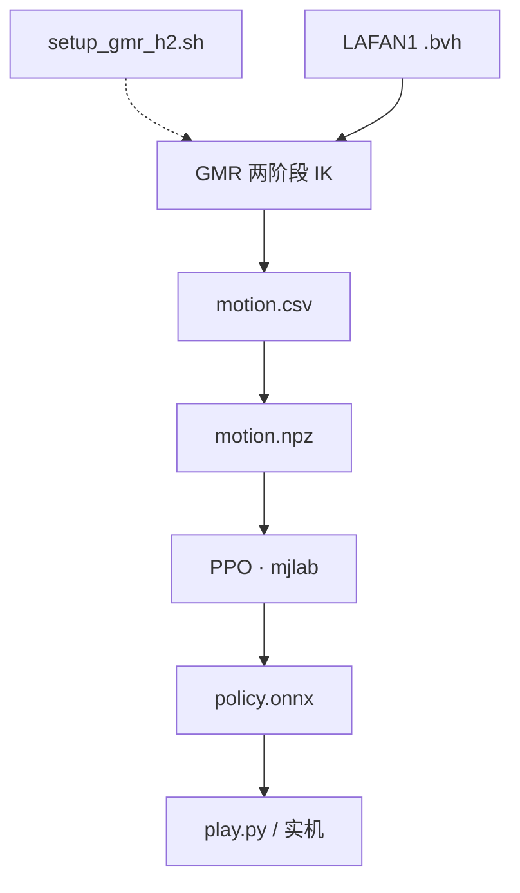
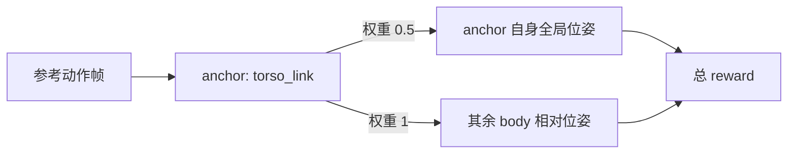

做人形机器人的动作追踪，网上能查到的资料基本停在 Unitree G1：GMR 的 IK config 有 G1，BeyondMimic 的官方实现注册的是 G1，社区博客写的也是 G1。轮到 H2 这台 29 自由度的新机器，每一环都得自己接。

这篇把整条链路——**人体 mocap → 机器人参考动作 → RL 策略**——在 H2 上从头铺一遍。

## 1. 缺口在哪

仓库本身（`unitree_rl_mjlab`，基于 [mjlab](https://github.com/mujocolab/mjlab)）在 4 月加过 H2 的 MJCF 和执行器配置，velocity 任务能跑；但从那往上，一层都没有。

| 层 | 上游现成的 | H2 上缺的 |
|---|---|---|
| 动作来源 | LAFAN1（bvh 人体 mocap） | —— 通用，不挑机器人 |
| retargeting | [GMR](https://github.com/YanjieZe/GMR)：人体骨架 → 机器人 qpos | 没有 H2 的 IK config 和 mocap 场景；入口脚本强制开 viewer，集群跑不了 |
| 仿真 / RL | mjlab（MuJoCo Warp + Isaac Lab 风格 API） | 只注册了 velocity 任务，没人训过 |
| tracking | [BeyondMimic](https://github.com/HybridRobotics/whole_body_tracking) 的 mjlab 实现 | 只注册了 G1；末端体名、关节树顺序、接触规模全对不上 |

## 2. 全景流水线



*Figure 1. 从人体动捕到可部署策略的完整链路。虚线是只做一遍的接线工作（装 MJCF、mocap 场景、IK config，再 patch `params.py`）。bvh 是 30 fps 人体动捕，retargeting 在 CPU 上约 2 分钟一段；csv 入 git 便于人工回放 QC；转 npz 时插值到 50 fps 并用有限差分补出速度；训练是 4096 envs 的 PPO。*

一个刻意的设计：**中间产物落地成 csv 并入 git**。retargeting 是整条链路里最容易出隐蔽错误的一环，csv 可以直接回放、可以和别的机器人逐列对比，出了问题不用等到重跑 GPU 训练才发现。

## 3. 地基：先让 H2 走起来

在碰 tracking 之前先训一个 velocity tracking 策略。理由不是「由易到难」，而是**自检**：如果 MJCF 的质量分布、执行器增益、接触参数三者之间有不自洽的地方，velocity 任务会以摔倒的形式立刻告诉你；而在 tracking 任务里，同样的问题会伪装成「参考动作 retarget 得不好」，极难定位。

<video src="/assets/robotics/humanoid/h2-flat-locomotion.mp4" controls muted playsinline loop></video>

*Figure 2. `Unitree-H2-Flat` 策略在平地上的全向行走，`model_10000`。蓝色箭头是采样出的速度指令。*

4096 envs、10001 iterations，A100 上约 5 小时，最终 episode length 顶格、摔倒约 0.04 次/episode，产物是可直接进部署栈的 `policy.onnx`。

有个容易误判的现象值得记一笔：**reward 曲线在 iteration 5000 附近见顶 ≈37，之后回落到 ≈25，但 episode length 一直贴着上限**。这不是训崩了——action std 在同期从 0.98 退火到 0.46，策略从探索转向利用，各 reward 分项的配比随之重新平衡。只看 mean reward 会误以为需要回滚 checkpoint。

顺带一提，动作缩放是**逐组**算的，不是全局一个常数：

$$
a_{\text{scale}} = 0.25 \cdot \frac{\tau_{\max}}{k_p}
$$

H2 的执行器按刚度分了六组（腿 200、腰 150、踝与臂 40、腕 20），所以腿和腕的动作幅度差了一个量级。

## 4. Retargeting：把 GMR 接到 H2

### 4.1 GMR 在做什么

GMR 解的是一个逐帧的加权逆运动学问题：给定人体骨架上若干标记点的位置与朝向，求机器人关节角，使机器人对应连杆尽量对齐。

$$
q^{\star} = \arg\min_{q} \sum_{i} \Big[ w_i^{p} \big\lVert p_i(q) - \hat{p}_i \big\rVert^2 + w_i^{r} \big\lVert \log\big(\hat{R}_i^{\top} R_i(q)\big) \big\rVert^2 \Big]
$$

IK config 里每一行就是一个 $i$——对应哪根人体骨骼、位置和姿态各占多少权重、要不要加一个恒定偏移：

```jsonc
"torso_link": [
  "Spine2",                     // 对应的人体骨骼
  0,                            // w_pos —— 位置权重
  50,                           // w_rot —— 姿态权重
  [0.0, 0.0, 0.0],              // 位置偏移
  [0.5720614, 0.5720614,        // 姿态偏移（四元数 wxyz）
   0.41562694, 0.41562694]
]
```

config 里有两张表，对应两个求解阶段：stage 1 完全不约束 pelvis 位置（$w^p = 0$），只管把整体朝向立住；stage 2 才把 pelvis 位置权重拉满做精修。

接线本身不难——把 H2 的 MJCF、mocap 场景、IK config 放进 GMR，再往 `params.py` 的四个字典各插一行。值得说的是这个 patch 脚本**带断言**：上游一旦改了字典写法，脚本直接失败，而不是静默地什么都没插入、然后两小时后以一个莫名其妙的 KeyError 收场。GMR 的入口脚本还硬性要求显示设备，集群上得换成一个几十行的 headless driver。

### 4.2 照抄 G1 的权重是不行的

直接把 G1 的 config 改个名字，是跑得起来的——但跑出来的动作错得很有欺骗性：机器人在动，姿态大体像，只是**永久性地前倾驼背**，waist 恒定偏 +15°。

肉眼看「像不像」发现不了这个，因为永久偏置恰恰是最容易被眼睛适应掉的那类错误。可靠的办法是把 csv 回放到 H2 模型上，和官方对同一段动作的 G1 retarget 结果**逐帧数值对比 root 与 waist 的 pitch**。

调了几轮之后，根因是两个：

- **H2 的质量分布和 G1 不同**，pelvis 姿态用 G1 的权重约束得太松，得显著调高；
- **H2 的 `torso_link` 相对 G1 的约定存在一个恒定的 −18° pitch 偏差**，得在 IK 目标上补一个偏移。

第二条的方向靠先验推容易推反（我第一次就推反了，waist 直接饱和 72%）。与其推，不如跑一次 2 分钟的 CPU 任务定符号。最终落到 config 里的那个四元数就是 $q_{\text{base}} \otimes q_y(-18°)$：

$$
[0.5,\,0.5,\,0.5,\,0.5] \otimes q_y(-18°) = [0.57206,\,0.57206,\,0.41563,\,0.41563]
$$

<video src="/assets/robotics/humanoid/h2-retarget-lafan1.mp4" controls muted playsinline loop></video>

*Figure 3. 修好之后的 retargeting 结果，LAFAN1 `dance1_subject2` 回放到 H2（纯运动学，未经物理仿真）。躯干保持直立。*

还有一条不会报错但会毁掉结果的：**H2 的踝关节链是 roll → pitch，和 G1 的 pitch → roll 相反**。所以足端体是 `ankle_pitch_link` 而不是 `ankle_roll_link`——IK 目标、tracking 的 body 列表、termination 的末端列表，三处都得跟着改。

## 5. Tracking policy：把 BeyondMimic 搬到 H2

### 5.1 机制：anchor 相对 + 指数核

BeyondMimic 的核心设计是**把全局跟踪和姿态跟踪解耦**：选一个 anchor body（H2 上是 `torso_link`），anchor 自己的全局位姿进 reward，其余 body 只跟踪相对 anchor 的位姿。



*Figure 4. anchor 相对分解：anchor 自己的位姿在世界系里算误差，其余 13 个 body 只算相对 anchor 的位姿。相对项权重是全局项的两倍——这个配比决定了策略在「姿态对」和「位置对」之间偏向前者，也就是允许长序列上的全局漂移。*

所有跟踪项都走同一个指数核，$\sigma$ 决定「多大的误差算大」：

$$
r_{\text{term}} = \exp\!\left(-\frac{\lVert e \rVert^2}{\sigma^2}\right)
$$

位置项 $\sigma = 0.3$、朝向项 $0.4$、线速度 $1.0$、角速度 $\pi$，另外三个负权重项管动作平滑、关节限位和自碰撞。

### 5.2 Adaptive sampling：长动作训得动的关键

一段 132 秒的舞蹈，均匀采样初始状态意味着难的那几秒和站着不动的那几秒被同等对待。BeyondMimic 的做法是**按失败率自适应地重采样起点**：

```
把整条动作切成 B 个 bin
每次 reset：
    统计失败 episode 落在哪个 bin  ──►  bin_failed_count

    p = bin_failed_count + uniform_ratio / B    # 保底均匀分量
    p = conv1d(p, kernel)                       # 非因果核平滑
    p = p / p.sum()

    起点 bin ~ Multinomial(p)
```

两个细节值得单独说：

- **保底均匀分量不能省**。否则一旦某个 bin 早期失败率为 0，它的采样概率永远是 0，策略会在那段上悄悄退化。
- **卷积核是非因果的**，难点 bin 的概率会向**前**扩散——因为要通过第 $k$ 秒的难动作，得先能顺利到达第 $k$ 秒。

代码里还把采样分布的归一化熵记成了 metric，训练时能直接看出分布有没有塌到某几个 bin 上。

至于 H2 特有的改动，除了前面说的体名替换，最值得记的是**接触缓冲区要调大**（`nconmax` 35→60、`njmax` 250→400）：H2 的姿态产生的同时接触数远超 G1 调好的默认值，而症状极其隐蔽——训练日志里一行 `nefc overflow`，约束被静默丢弃；渲染脚本则直接 SIGABRT。

## 6. 结果，以及一个诚实的观察

<video src="/assets/robotics/humanoid/h2-tracking-policy.mp4" controls muted playsinline loop></video>

*Figure 5. `Unitree-H2-Tracking-No-State-Estimation`，`model_30000`。白色是策略，绿色半透明是参考动作。*

姿态确实跟住了。但注意白色和绿色**在空间上是分开的**——这正是 5.1 节那个权重配比的直接后果：相对姿态权重是全局位置的两倍，长序列上全局位置会持续累积漂移。

这不是 bug，是设计取舍，而且代码库里就带着承认这一点的证据：`metrics.py` 里除了 MPKPE 还专门实现了 `compute_root_relative_mpkpe`，docstring 写得很直白——*"measures pose error independent of global drift"*。要报「动作学得像不像」，看 R-MPKPE；要报「能不能走到指定位置」，那得是另一个任务。

## 7. Robust 变体：为部署加 DR，以及它的代价

基础策略在标称物理下跑得好，但实机上电机有延迟、增益有偏差、质量分布和 MJCF 不完全一致。于是从 `model_30000` 续训了一个 robust 变体，加上执行器延迟（0–20 ms）、PD 增益与全身质量各 ±15% / ±10%、关节摩擦、更强的推力扰动和更宽的地面摩擦。

有一项是**试过之后删掉的**：`effort_limits` 随机化。mjlab 的 `dr.effort_limits` 不会像 `dr.pd_gains` 那样解包 `DelayedActuator` 的外层 wrapper——而 robust 变体恰恰把每个执行器都包了一层延迟。写上去不会报错，只是**什么都不会发生**。与其留一个看起来有效实则空转的配置项，不如删掉。

代价是实打实的：


*Figure 6. 同一段参考动作、同一时刻的对比。白色为策略，绿色为参考。两个 run 从同一帧同步起步（t=0 时两者重合），随时间推移，加了重度 DR 的 robust 策略与参考的全局距离明显大于基础策略。*

姿态两者都跟得住，但 robust 策略的全局漂移显著更大。这可以理解——策略被迫在一个更宽的物理参数分布上都能站住，就得放弃一部分对标称物理的精确拟合。**要部署就得接受这个交换**；至于换得值不值，只有上了实机才知道，这一步目前还没做。

## 8. 小结

把这条链路在一台没有公开资料的机器人上铺通，真正花时间的不是训练，而是**建立可信的中间检查点**：csv 落地入 git、逐帧数值对比而不是肉眼看、给 patch 脚本加断言、把采样熵记成 metric。

这些都不产出任何 reward 曲线上的数字，但它们决定了出问题时你是花 20 分钟还是花两天。回头看，最难缠的几个坑——驼背偏置、踝链顺序反转、接触缓冲溢出、空转的 DR 配置——共同点都是**不报错**。在一个没有前人教程的目标上，能让错误尽早以「报错」而非「结果有点怪」的形式暴露出来，就是最划算的投资。

---

*代码：[`unitree_rl_mjlab`](https://github.com/openhe-hub/unitree_rl_mjlab) 的 `scripts/gmr_h2/`、`src/tasks/tracking/config/h2/`，完整复现步骤在 `doc/reproduction.md`。*
