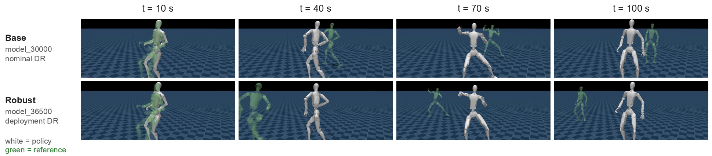

> 这是一篇工程记录，不是论文复现。所有数字都来自实际跑过的 run，所有坑都是真踩的。

做人形机器人的动作追踪，网上能查到的教程基本停在 Unitree G1：GMR 的 IK config 有 G1，BeyondMimic 的官方实现注册的是 G1，社区博客写的也是 G1。轮到 H2 这台 29 自由度的新机器时，每一环都得自己接。

这篇把整条链路——**人体 mocap → 机器人参考动作 → RL 策略**——在 H2 上从头铺一遍。

## 1. 缺口在哪

先说清楚哪些是现成的、哪些得自己写。仓库本身（`unitree_rl_mjlab`，基于 [mjlab](https://github.com/mujocolab/mjlab)）在 4 月就加过 H2 的 MJCF 和执行器配置，velocity 任务能跑；但从那往上，一层都没有。

| 层 | 上游现成的 | H2 上缺的 |
|---|---|---|
| 动作来源 | LAFAN1（bvh 人体 mocap） | —— 通用，不挑机器人 |
| retargeting | [GMR](https://github.com/YanjieZe/GMR)：人体骨架 → 机器人 qpos | 没有 H2 的 IK config；没有 mocap 场景；入口脚本强制开 viewer，集群上跑不了 |
| 仿真 / RL | mjlab（MuJoCo Warp + Isaac Lab 风格 manager API） | H2 的 MJCF 和执行器在，但只注册了 velocity 任务，没人训过也没有复现记录 |
| tracking | [BeyondMimic](https://github.com/HybridRobotics/whole_body_tracking) 的 mjlab 实现 | 只注册了 G1；末端体名、关节树顺序、接触规模全对不上 |

所以工作量分三块：**训一个 H2 的 locomotion 策略当地基** → **把 GMR 接上 H2 产出参考动作** → **把 tracking 任务移植到 H2 并训出策略**。

## 2. 全景流水线

```
                     ┌─────────────── 一次性接线 ────────────────┐
                     │  setup_gmr_h2.sh                          │
                     │   ├─ h2.xml + h2_mocap.xml → GMR/assets/  │
                     │   ├─ bvh_lafan1_to_h2.json → ik_configs/  │
                     │   └─ patch params.py（4 处字典注册）      │
                     └───────────────────┬───────────────────────┘
                                         │
  LAFAN1 .bvh                            ▼
  (30 fps 人体 mocap)  ──►  GMR 两阶段加权 IK  ──►  .pkl
                            [CPU · ~2 min/段]        │
                                                     │ batch_gmr_pkl_to_csv
                                                     ▼
                                                   .csv   ← 入 git，可人工 QC
                                                     │
                            csv_to_npz.py --robot h2 │  [GPU]
                            30 → 50 fps 插值          │  lerp / slerp
                            有限差分补速度            ▼
                                                   .npz   参考轨迹
                                                     │    (pos/quat/lin_vel/ang_vel)
                                                     ▼
                          ┌──────────────────────────────────────┐
   H2-Flat velocity ─────►│  PPO (rsl_rl) · 4096 envs · mjlab    │
   策略（地基/自检）      │  Unitree-H2-Tracking-*               │
                          └──────────────────┬───────────────────┘
                                             │
                                    model_*.pt + policy.onnx
                                             │
                                             ▼
                                   play.py（渲染验证） / 实机部署
```

*Figure 1. 从人体动捕到可部署策略的完整链路。虚框内是接 GMR 的一次性改动，其余每一步都有对应的 sbatch 包装。*

一个刻意的设计：**中间产物落地成 csv 并入 git**。retargeting 是整条链路里最容易出隐蔽错误的一环，csv 可以直接回放、可以和别的机器人逐列对比，出了问题不用重跑 GPU 训练才发现。

## 3. 地基：先让 H2 走起来

在碰 tracking 之前先训一个 velocity tracking 策略。理由不是"由易到难"，而是**自检**：如果 MJCF 的质量分布、执行器增益、接触参数三者之间有不自洽的地方，velocity 任务会以摔倒的形式立刻告诉你；而在 tracking 任务里，同样的问题会伪装成"参考动作 retarget 得不好"，极难定位。

<video src="/assets/robotics/humanoid/h2-flat-locomotion.mp4" controls muted playsinline loop></video>

*Figure 2. `Unitree-H2-Flat` 策略在平地上的全向行走，`model_10000`。蓝色箭头是采样出的速度指令。*

| 项 | 值 |
|---|---|
| 任务 | `Unitree-H2-Flat`（速度跟踪，平地） |
| 硬件 | 1× A100 40GB / 16 核 / 100GB |
| 规模 | 4096 envs，10001 iters，≈55k FPS |
| 墙钟时间 | 4 h 58 m |
| 最终指标 | mean reward ≈ 25，episode length ≈ 1000（顶格），摔倒 ≈ 0.04 次/episode |
| 产物 | `model_10000.pt` + `policy.onnx`（可直接进部署栈） |

这里有个容易误判的现象值得记一笔：**reward 曲线在 iteration 5000 附近见顶 ≈37，之后回落到 ≈25，但 episode length 一直贴着上限**。这不是训崩了——action std 在同期从 0.98 退火到 0.46，策略从探索转向利用，各 reward 分项的配比随之重新平衡。只看 mean reward 会误以为需要回滚 checkpoint。

动作缩放沿用 mjlab 的惯例，按每组执行器的力矩上限与刚度定：

$$
a_{\text{scale}} = 0.25 \cdot \frac{\tau_{\max}}{k_p}
$$

H2 的执行器按刚度分了六组（腿 200、腰 150、踝与臂 40、腕 20），所以这个缩放是**逐组**算的，不是全局一个常数——腿和腕的动作幅度差了一个量级。

## 4. Retargeting：把 GMR 接到 H2

### 4.1 GMR 在做什么

GMR 解的是一个逐帧的加权逆运动学问题：给定人体骨架上若干标记点的位置与朝向，求机器人关节角，使得机器人上对应连杆尽量对齐。

$$
q^{\star} = \arg\min_{q} \sum_{i} \Big[ w_i^{p} \big\lVert p_i(q) - \hat{p}_i \big\rVert^2 + w_i^{r} \big\lVert \log\big(\hat{R}_i^{\top} R_i(q)\big) \big\rVert^2 \Big]
$$

其中 $\hat{p}_i, \hat{R}_i$ 是人体骨骼经过缩放和偏移后的目标，$p_i(q), R_i(q)$ 是机器人连杆的正运动学。IK config 里每一行就是一个 $i$：

```jsonc
"torso_link": [
  "Spine2",                     // 对应的人体骨骼
  0,                            // w_pos —— 位置权重
  50,                           // w_rot —— 姿态权重
  [0.0, 0.0, 0.0],              // 位置偏移
  [0.5720614, 0.5720614,        // 姿态偏移（四元数 wxyz）
   0.41562694, 0.41562694]
]
```

config 里有两张表（`ik_match_table1` / `ik_match_table2`），对应两个求解阶段。从权重能直接读出分工：**stage 1 里 pelvis 的位置权重是 0、姿态权重 50**，只管把整体朝向立住；**stage 2 把 pelvis 位置权重拉到 100**，再做位置精修。理解这一点很关键——调参时改错了表，症状会完全对不上。

### 4.2 接线：三个文件加一次 patch

GMR 认机器人靠 `params.py` 里的几个字典。与其 fork 一份，不如写一个**幂等且带断言**的 patch 脚本：

```bash
# scripts/gmr_h2/setup_gmr_h2.sh（节选）
cp "${H2_XML_DIR}/h2.xml"        "${GMR_DIR}/assets/unitree_h2/h2.xml"
cp "${SCRIPT_DIR}/h2_mocap.xml"  "${GMR_DIR}/assets/unitree_h2/h2_mocap.xml"
ln -sfn "${H2_XML_DIR}/assets"   "${GMR_DIR}/assets/unitree_h2/assets"   # meshes 走软链
cp "${SCRIPT_DIR}/bvh_lafan1_to_h2.json" \
   "${GMR_DIR}/general_motion_retargeting/ik_configs/"
```

```python
# 同一脚本内联的 params.py patch —— 四处字典各插一行
text = text.replace('ROBOT_XML_DICT = {\n',
    'ROBOT_XML_DICT = {\n    "unitree_h2": ASSET_ROOT / "unitree_h2" / "h2_mocap.xml",\n', 1)
# ... IK config / ROBOT_BASE_DICT / VIEWER_CAM_DISTANCE_DICT 同理

missing = [e for e in expected if e not in text]
if missing:
    sys.exit(f"params.py insertion failed for {missing} (upstream layout changed?)")
```

最后那三行是重点：上游一旦改了字典的写法，脚本会**直接失败**，而不是静默地什么都没插入、然后在两小时后以一个莫名其妙的 KeyError 收场。

另外 GMR 的入口脚本 `bvh_to_robot.py` 无条件打开 MuJoCo viewer，集群节点上没有显示设备。用一个约 40 行的 headless driver 替掉即可，核心就是把 viewer 那层去掉、直接落 pkl：

```python
frames, actual_human_height = load_bvh_file(args.bvh_file, format=args.format)
retargeter = GMR(src_human=f"bvh_{args.format}", tgt_robot=args.robot,
                 actual_human_height=actual_human_height)
qpos = np.stack([retargeter.retarget(f) for f in tqdm(frames)])

motion_data = {
    "fps": args.motion_fps,
    "root_pos": qpos[:, :3],
    "root_rot": qpos[:, [4, 5, 6, 3]],   # wxyz -> xyzw，对齐 GMR 自己的 pkl 约定
    "dof_pos": qpos[:, 7:],
}
```

### 4.3 五轮 IK 权重调参

直接把 G1 的 config 改个名字是跑得起来的——但跑出来的动作是错的，而且错得很有欺骗性：机器人在动，姿态大体像，只是**永久性地前倾驼背**。

QC 方法：把 csv 用 `csv_to_npz.py --render` 回放到 H2 模型上，再和 Unitree 官方对同一段动作的 G1 retarget 结果**逐帧数值对比 root 与 waist 的 pitch**。肉眼看"像不像"是不够的，永久偏置恰恰是最容易被眼睛适应掉的那类错误。

| 版本 | 改动 | 结果 |
|---|---|---|
| v1 | 照抄 G1 config，腿 ×1.1 / 臂 ×0.95，末端取 `ankle_pitch_link` | pelvis 前倾 11°，waist 恒定 +15° 驼背，7.4% 帧偏差 >15° |
| v2 | pelvis 姿态权重 10→50（stage 1）、5→30（stage 2） | 偏置 −11° → −3°，极端帧仍在 |
| v3 | stage 2 躯干姿态 10→50、肩 100→50 | pelvis 跟得死死的；waist 仍 +17° |
| v4 | 躯干目标叠加 pitch(**+18°**) 偏移 | 符号反了：waist 饱和 72% |
| v5 | 躯干目标叠加 pitch(**−18°**) 偏移 | waist 均值 +0.1°，>15° 偏差帧 0% —— 采用 |

两个根因：**(a)** H2 的质量分布和 G1 不同，pelvis 姿态用 G1 的权重约束得太松；**(b)** H2 的 `torso_link` 相对 G1 的约定存在一个恒定的 −18° pitch 偏差。

v4 那一步"白跑"其实是最省事的做法：偏移方向靠先验推容易推反，跑一次 2 分钟的 CPU 任务就能定符号。最终落到 config 里的四元数是 $q_{\text{base}} \otimes q_{\text{pitch}}(-18°)$：

$$
[0.5,\,0.5,\,0.5,\,0.5] \otimes q_y(-18°) = [0.57206,\,0.57206,\,0.41563,\,0.41563]
$$

<video src="/assets/robotics/humanoid/h2-retarget-lafan1.mp4" controls muted playsinline loop></video>

*Figure 3. v5 config 的 retargeting 结果，LAFAN1 `dance1_subject2` 回放到 H2（纯运动学，未经物理仿真）。躯干保持直立，没有 v1 的驼背偏置。*

### 4.4 三个静默出错的约定

这三条都不会报错，只会让结果安静地变成垃圾：

- **踝关节链是 roll → pitch**，和 G1 的 pitch → roll 相反。于是 H2 的足端体是 `ankle_pitch_link` 而不是 `ankle_roll_link`——IK 目标、tracking 的 `body_names`、termination 的末端列表，三处都得改。
- **root 四元数是 xyzw**（`csv_to_npz.py` 按这个读）。GMR 内部是 wxyz，转换点在 headless driver 里。
- **dof 列序按 MJCF 树序**，所以跨机器人回放别人的 csv 时才需要 `--joint-order`；同机器人回放传了反而错。

## 5. Tracking policy：把 BeyondMimic 搬到 H2

### 5.1 机制：anchor 相对 + 指数核

BeyondMimic 的核心设计是**把全局跟踪和姿态跟踪解耦**。选一个 anchor body（H2 上是 `torso_link`），然后：

- anchor 自己的**全局**位置/朝向进 reward，权重各 0.5；
- 其余 13 个 body 只跟踪**相对 anchor** 的位置/朝向，权重各 1.0。

所有跟踪项都走同一个指数核，$\sigma$ 决定"多大的误差算大"：

$$
r_{\text{term}} = \exp\!\left(-\frac{\lVert e \rVert^2}{\sigma^2}\right)
$$

| Reward 项 | 权重 | $\sigma$ | 作用 |
|---|---|---|---|
| `motion_global_root_pos` | 0.5 | 0.30 | anchor 全局位置 |
| `motion_global_root_ori` | 0.5 | 0.40 | anchor 全局朝向 |
| `motion_body_pos` | 1.0 | 0.30 | 各 body 相对 anchor 位置 |
| `motion_body_ori` | 1.0 | 0.40 | 各 body 相对 anchor 朝向 |
| `motion_body_lin_vel` | 1.0 | 1.00 | 全局线速度 |
| `motion_body_ang_vel` | 1.0 | 3.14 | 全局角速度 |
| `action_rate_l2` | −0.1 | — | 动作平滑 |
| `joint_limit` | −10.0 | — | 关节限位 |
| `self_collisions` | −10.0 | — | 自碰撞（力阈值 10 N） |

这个权重配比意味着：**姿态优先于位置**。策略宁可整体飘出去半米，也要把动作姿态做对。第 6 节的视频里能直接看到这个取舍的后果。

### 5.2 Adaptive sampling：长动作训得动的关键

一段 132 秒的舞蹈，均匀采样初始状态意味着难的那几秒和站着不动的那几秒被同等对待。BeyondMimic 的做法是**按失败率自适应地重采样起点**：

```
把整条动作切成 B 个 bin
每次 reset：
    记录失败的 episode 落在哪个 bin  ──►  bin_failed_count

    p = bin_failed_count + uniform_ratio / B      # 保底均匀分量，防止饿死
    p = conv1d(p, kernel)                         # 非因果核平滑：难点前面的
                                                  # bin 也要多练，否则进不去
    p = p / p.sum()

    起点 bin ~ Multinomial(p)
    起点时刻 = (bin + U(0,1)) / B * T
```

两个细节值得单独说：

- **保底均匀分量**（`adaptive_uniform_ratio`）不能省。否则一旦某个 bin 早期失败率为 0，它的采样概率永远是 0，策略会在那段上悄悄退化。
- **卷积核是非因果的**（右侧 replicate padding）。难点 bin 的概率会向**前**扩散，因为要通过第 $k$ 秒的难动作，得先能顺利到达第 $k$ 秒。

代码里还顺手把采样分布的**归一化熵**和 top-1 概率记成了 metric，训练时能直接看出分布有没有塌到某几个 bin 上——这比事后从 reward 曲线猜有用得多。

### 5.3 H2 上必须改的四处

| 改动 | 值 | 为什么 |
|---|---|---|
| `nconmax` / `njmax` | 60 / 400（默认 35 / 250） | H2 的姿态产生的同时接触数远超 G1 调好的默认值。**症状极其隐蔽**：训练日志里一行 `nefc overflow`，约束被静默丢弃；`csv_to_npz --render` 则直接 SIGABRT |
| `anchor_body_name` | `torso_link` | —— |
| `body_names` | 14 个，足端用 `ankle_pitch_link` | 踝链顺序反转 |
| `ee_body_pos` termination | 两踝 + 两腕 `wrist_yaw_link` | 同上 |

`csv_to_npz.py` 里也得单独抬到 100 / 500——回放脚本走的是另一条 sim 配置路径，很容易只改了训练那边然后困惑为什么渲染还在崩。

## 6. 结果，以及一个诚实的观察

<video src="/assets/robotics/humanoid/h2-tracking-policy.mp4" controls muted playsinline loop></video>

*Figure 4. `Unitree-H2-Tracking-No-State-Estimation`，`model_30000`。白色是策略，绿色半透明是参考动作。姿态跟得很紧，但两者的全局位置已经明显分开。*

姿态确实跟住了。但注意白色和绿色**在空间上是分开的**——这正是 5.1 节那个权重配比的直接后果：相对姿态权重是全局位置的两倍，长序列上全局位置会持续累积漂移。

这不是 bug，是设计取舍，而且代码库里就带着承认这一点的证据：`metrics.py` 里除了 MPKPE 还专门实现了 `compute_root_relative_mpkpe`，docstring 写得很直白——*"measures pose error independent of global drift"*。要报"动作学得像不像"，看 R-MPKPE；要报"能不能走到指定位置"，那得是另一个任务。

## 7. Robust 变体：为部署加 DR，以及它的代价

基础策略在标称物理下跑得好，但实机上电机有延迟、增益有偏差、质量分布和 MJCF 不完全一致。于是从 `model_30000` 续训了一个 `Unitree-H2-Tracking-Robust-No-State-Estimation`，加上一整套面向部署的域随机化：

| DR 项 | 范围 | 模式 |
|---|---|---|
| `actuator_delay` | 0–4 个物理步（0–20 ms @ 5 ms） | reset |
| `pd_gains` | $k_p, k_d$ ×(0.85, 1.15) | reset |
| `body_mass` | ×(0.9, 1.1)，全身 | reset |
| `joint_friction` | +(0.0, 0.03) | reset |
| `push_robot` | 线速度 ±0.7 m/s、角速度 ±1.0 rad/s | interval |
| `foot_friction` | (0.2, 1.3)，原为 (0.3, 1.2) | startup |
| `encoder_bias` | ±0.02 rad，原为 ±0.01 | startup |

有一项是**试过之后删掉的**：`effort_limits` 随机化。原因是 mjlab 的 `dr.effort_limits` 不会像 `dr.pd_gains` 那样解包 `DelayedActuator` 的外层 wrapper——而 robust 变体恰恰把每个执行器都包了一层延迟。写上去不会报错，只是**什么都不会发生**。位置控制的关节本来也很少顶到力矩上限，索性去掉，免得留一个看起来有效实则空转的配置项。

代价是实打实的：



*Figure 5. 同一段参考动作、同一时刻的对比。白色为策略，绿色为参考。两个 run 从同一帧同步起步（t=0 时两者重合），随时间推移，加了重度 DR 的 robust 策略与参考的全局距离明显大于基础策略。*

姿态两者都跟得住，但 robust 策略的全局漂移显著更大。这是可以理解的——策略被迫在一个更宽的物理参数分布上都能站住，就得放弃一部分对标称物理的精确拟合。**要部署就得接受这个交换**；至于换得值不值，只有上了实机才知道，这一步目前还没做。

## 8. 坑总表

| 坑 | 症状 | 处置 |
|---|---|---|
| `nefc` 溢出 | 日志一行 warning / 渲染 SIGABRT | `nconmax` 60、`njmax` 400；`csv_to_npz` 100 / 500 |
| G1 config 直接套用 | 动作"像"但永久驼背前倾 | 五轮权重调参，躯干加 −18° pitch 偏移 |
| 踝链 roll→pitch 反转 | 无报错，末端跟踪目标错位 | 三处 body 名全改 `ankle_pitch_link` |
| 四元数 xyzw / wxyz | 无报错，姿态乱转 | 转换点集中在 headless driver |
| `effort_limits` DR | 无报错，配置完全空转 | 删掉（mjlab 不解包 `DelayedActuator`） |
| GMR `bvh_to_robot.py` | 集群上无显示设备直接崩 | 自写 headless driver |
| GMR 依赖 | `daqp` 求解器与 `torch` 均未声明 | 手动装（torch 装 CPU 版即可） |
| mujoco ≥ 3.6 | 移除了 `mjENBL_MULTICCD`，mujoco-warp 3.5.0 仍引用 | pin `mujoco>=3.5,<3.6` |
| warp ≥ 1.13 | 隐藏了 `wp.context`，mjlab 1.2.0 要用 | pin `warp-lang==1.12.1` |
| wandb 中途卡死 | 曲线停更，训练其实正常 | 看 checkpoint 的 mtime |
| Slurm stdout 块缓冲 | `.out` 落后十几分钟，像挂了 | 同上 |
| tyro 布尔 flag | `--video` 不行 | 必须写 `--video=True` |

## 9. 小结

把这条链路在一台没有公开资料的机器人上铺通，真正花时间的不是训练，而是**建立可信的中间检查点**：csv 落地入 git、逐帧数值对比而不是肉眼看、把采样熵记成 metric、给 patch 脚本加断言。

这些都不产出任何 reward 曲线上的数字，但它们决定了出问题时你是花 20 分钟还是花两天。上面那张坑表里，绝大多数条目的共同点是**不报错**——在一个没有前人教程的目标上，能让错误尽早以"报错"而非"结果有点怪"的形式暴露出来，就是最划算的投资。

下一步是实机部署，届时 robust 变体那笔交换到底值不值，才会有答案。

---

*代码：[`unitree_rl_mjlab`](https://github.com/openhe-hub/unitree_rl_mjlab) 的 `scripts/gmr_h2/`、`src/tasks/tracking/config/h2/`，完整复现步骤在 `doc/reproduction.md`。*
